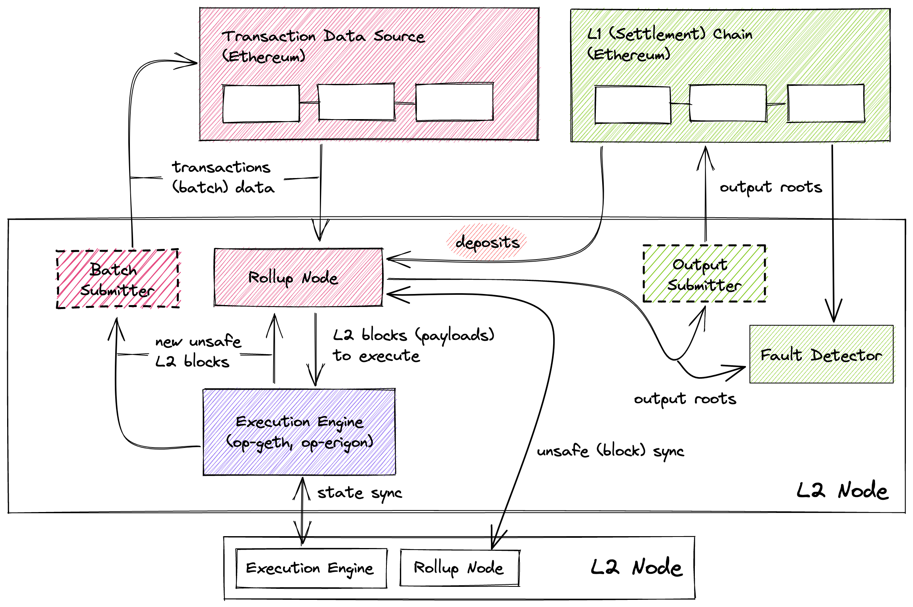

# OP Stack Primer

This document gives some background on the operation of the OP stack, and explains how it is
configured and run, in particular when using roll-op.

<!-- TOC -->
* [OP Stack Primer](#op-stack-primer)
  * [OP Stack Actors](#op-stack-actors)
  * [OP Stack Architecture / Data Flow](#op-stack-architecture--data-flow)
  * [OP Stack Deployment](#op-stack-deployment)
  * [OP Stack Operation](#op-stack-operation)
  * [Devnet L1](#devnet-l1)
<!-- TOC -->

## OP Stack Actors

We can explain the OP stacks in terms of three "actors".

First the L1 chain. It of course has its own actors, but for our purposes we can treat as a single
abstract entity that we interact with and do not control.

roll-op does allow you to spin your own L1 for testing purposes (a "devnet L1"), and that is made of
a single geth node using the *clique* proof-of-authority consensus. More on this in the last section
of this document.

The second actor is the L2 sequencer, of which there can (at present) only be one. The sequencer
runs an L2 node in sequencing mode, an L2 execution engine, as well as the L2 batcher and the L2
proposer.

Finally, normal L2 nodes only run an L2 node in normal mode, and an L2 execution engine.

L2 nodes are also expected to run a fault detector / challenger agent. The sequencer is expected to
run it too, as a form of sanity checking. roll-op does not support yet, and we will not explain the
challenge flow in this document.

## OP Stack Architecture / Data Flow



> This is a diagram I made last year. In this document, I use the following terms:
> - rollup node → L2 node
> - batch submitter → L2 batcher
> - execution engine → L2 engine
> - output submitter → L2 proposer
> - deposits → "L1 → L2 messages"
> 
> Don't freak if you don't get the diagram, read the explanation then come back to it.

Users send transactions to the L2 sequencer. The L2 execution engine (L2 engine for short) is the
service that actually receives these transactions.

The L2 engine is a modified Ethereum execution layer client. Curently roll-op support op-geth, with
more to come (op-erigon, op-reth and Hildr are other options). You can see the full list of
modification to geth [here][geth-diff], and to Erigon [here][erigon-diff]. Essentially, these
modifications implement new L2 transaction types, and support communicationation with the L2 node.

[geth-diff]: https://op-geth.optimism.io/
[erigon-diff]: http://op-erigon.testinprod.io/

Because the L2 engine is just like an Ethereum execution client, transactions enter its mempool.
This mempool can be public (gossiped to other nodes) or private (as it is on OP Mainnet).

The L2 engine is responsible for execution and not much else. The L2 block creation is actually
driven by the L2 node of the sequencer.

Every 2s (or whatever block time is configured), the L2 node of the sequencer will ask the L2 engine
to produce a new block from the transactions in its mempool.

Every so often (this being configurable along multiple dimensions), the L2 batcher will pick up
blocks from the L2 engine, batch them and compress them together, and submit them to the *batch
inbox address* on the L1 chain. This address is currently some arbitrary address and not a contract,
the batches are submitted as *calldata* on the L1 chain.

The L2 nodes (both in sequencing and normal mode) track the transactions on the L1 chain, decode
the batches posted there, and derive the L2 blocks from them.

For the sequencing L2 node, this will most often consist of checking that the view from the L1 chain
(the source of truth) matches the local view. Assuming no foul play and no re-orgs of the L1 chains,
older local blocks should match up perfectly with what was posted on L1. In the case of a re-org,
the L2 node instructs the L2 engine to re-org the L2 chain by discarding the blocks that conflict
with the L1 chain.

L1 re-orgs can cause L2 re-orgs because the L2 chain needs to process L1 → L2 messages (notably used
to bridge assets), and if a message wasn't sent on L1, it can't be received on L2!

L2 blocks carry an L1 block number that represents the latest L1 block whose messages have been
processed. The default and maximum delay at which this L1 block number is updated can be configured.
Increasing this delay makes it less likely that L1 re-orgs will cause L2 re-orgs, but it also
increases the time it will take for L1 → L2 messages to be received on the L2 chain.

The L2 nodes maintains three chain heads:

- The *unsafe chain* comprises all the blocks created by the sequencer.
- The *safe chain* comprises all the blocks that can be derived from the L1 chain.
- The *finalized chain* comprises all the blocks that can be derived from *finalized* L1 blocks.

The unsafe chain is always an extension of the safe chain, which is always an extension of the
finalized chain.

Regular L2 nodes can derive the safe and finalized chains by reading L1. They can also derive the
unsafe chain by receiving unsafe L2 blocks gossiped by the sequencer.

Periodically, the L2 proposer queries the sequencing L2 node, and submits finalized L2 blocks'
*output root* (basically L2 blockhashes + some extra goodies that can be extracted from the blocks,
mostly for convenience sake) to the *L2 output oracle* contract on L1.

The output roots can then be challenged for a configurable period of time (7 days on OP Mainnet).

Note that the *finalized head* — if honestly computed — is final. There is no way to change what the
canonical chain is and what its correct output roots are. These correct output roots result from the
correct application of the L2 state transition function. This transition function is implement both
by the L2 node / L2 engine tandem, and by the "OP program" — which is used for the challenge game
and whose code is committed to on the L1 chain. The OP program shares as much code as possible with
the L2 node and L2 engine.

However, you still need to wait for the challenge period in order to process L2 → L1 (and thus
bridge withdrawals), because there is no way to directly prove that the output roots posted by the
proposer are the correct ones in the optmistic rollup paradigm. Instead, we consider that if no
challenge succeeded after the challenge period, then the output roots are correct.

## OP Stack Deployment

To deploy an OP stack rollup, it is only necessary to deploy its contracts onto the L1 chain. Then
you want to generate the L2 genesis file, and finally it's only a matter for the sequencer to run
the various OP stack services, configured accordingly to the configuration of the deployed rollup
contracts.

The Optimism monorepo comes with a [deployment script] that can be used to deploy the contracts to
your chain of choice.

[deployment script]: https://github.com/ethereum-optimism/optimism/blob/op-node/v1.4.0/packages/contracts-bedrock/scripts/Deploy.s.sol

The main piece of a configuration that goes into this is a file called the *deploy config*. You can
see the deploy config for various officialy-supported OP stack network [here][deploy-configs].

roll-op automatically generates the deploy config based on its own configuration.

[deploy-configs]: https://github.com/ethereum-optimism/optimism/tree/op-node/v1.4.0/packages/contracts-bedrock/deploy-config

Another important detail is that you have to give your deployment a name, as that will guide where
the deploy script looks for the deploy config and where it creates various output files — most
notably a list of the addresses of the deployed contracts, as well as an ABI file for each of them.

In roll-op, this is controlled by the `deployment_name` config option, which can also be set with
the `--name=NAME` command line flag. If deploying manually, you need to set the `DEPLOYMENT_CONTEXT`
environment variable.

(There are other environment variables you need to set, but just use roll-op, it's easier and better
documented.)

Once the contracts are deployed, you need to generate the L2 genesis file. The Optimism monorepo has
[a tool][gen-genesis] for this. It takes the deploy config as input, as well as the ABI files from
the deployed contracts. It generates the L2 genesis file, as well as a *rollup config* file that we
need to pass to the L2 node.

[gen-genesis]: https://github.com/ethereum-optimism/optimism/blob/op-node/v1.4.0/op-node/cmd/genesis/cmd.go

The L2 genesis file is used to initialize the L2 engine's database.

The next section will cover how the various OP stack services are configured and run.

## OP Stack Operation

From the Optimism monorepo, we build a binary for each service (`op-node`, `op-geth`, `op-batcher`,
`op-proposer`). These are copied to the `bin` directory.

After all the previous steps have been completely (rollup contracts deployed on L1, genesis created
and database initialized), it suffices to run the various services with the proper options.

The options must match the configuration of the rollup contracts, and each other. roll-op takes care
of this for you, deriving the proper options from its unique configuration file.

roll-op curently supports running the services locally. You can create cloud deployments by simply
cloning & running roll-op on your cloud server. Support for orchestrating cloud deployments directly
in rollup (via Ansible) is in the works.

In the manual approach, it's best to generate the config files and perform the contract deployment
on your dev machine, then copy the needed files (rollup config, genesis file) to your servers.

So you would do the following:

```bash
# locally
./rollop setup # prereq
./rollop --name=myrollup --config=config.toml deploy-l2 

# upload rollup config to server hosting op-node
# upload l2 genesis to server hosting op-geth
# upload config.toml to all servers

# clone rollop on cloud servers

# run on cloud (different servers)
./rollop --name=myrollup --config=config.toml l2-engine
./rollop --name=myrollup --config=config.toml l2-sequencer
./rollop --name=myrollup --config=config.toml l2-batcher
./rollop --name=myrollup --config=config.toml l2-proposer

# or run on cloud (same server)
 ./rollop --name=myrollup --config=config.toml l2
```

## Devnet L1

For testing purposes, roll-op allows you to spin an L1 chain. We always call this "devnet L1" to
underscore that it is only to be used for local testing. The feature is modelled after the
equivalent capability in the Optimism monorepo.

The devnet L1 is a single geth node running the *clique* proof-of-authority consensus.

There are two ways to leverage the devnet L1: either deploy the contracts on them the normal way, or
bake these contracts into the L1 genesis file.

Baking the contracts in the genesis file saves time when running multiple devnets in succession, as
there is no need to redeploy the contracts every time. The Optimism monorepo does this to speed up
testing.

Currently, this is the only supported option (because we use a [tool][gen-genesis] from the Optimism
monorepo to generate the L1 genesis), but in the future, we will allow bypassing including the
rollup contracts in the genesis file.

When creating the L1 genesis files with pre-deploys, a temporary L1 node is started, the contracts
are deployed to it, and then dumped to the genesis file.